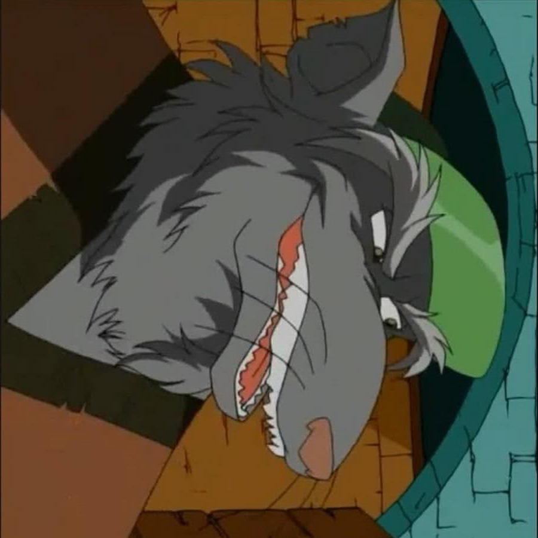

# BMP rotation
## Example
 
## Build & run
- To build you need to type `cmake CMakeLists.txt | make` in the project directory.
- To run you need to type `../bmp-rotate input_name.bmp [output_name_1.bmp..output_name_n.bmp]`